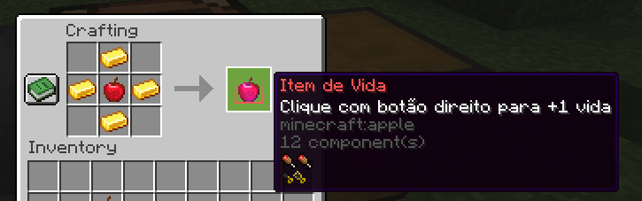
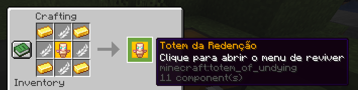

# vidasplugin-buildable
esse plugin foi originalmente """""feito""""" pelo EnzoDadam (Enz0oMC), conhecido tambem como ChatGPT, eu so obtive ele e decompilei.\

So mais um aviso, o plugin contem um exploit ja identificado usando o [UI Utils](https://github.com/Coderx-Gamer/ui-utils/releases) e o Totem da Redenção, so com 1 totem é possivel renascer todos (nao vou gastar meu tempo arrumando isso lol)

## Buildando voce mesmo

Pra buildar basta dar:
```bash
git clone https://github.com/Visivel/vidasplugin-buildable.git
cd vidasplugin-buildable
se quiser alterar alguma coisa (tipo a versao), atualize a versão e/ou dependencias do pom.xml se necessario
mvn clean package
```

## Documentação do Plugin (Como usar)
ft Deepseek, não vou gastar tempo documentando perca de tempo (plugin de Minecraft feito por gpt)

### 👤 Comandos para jogadores

| Comando | Descrição | Permissão |
|---------|-----------|-----------|
| `/vidas` | Mostra quantas vidas você tem | `vidas.user` |
| `/vidas doar <jogador> <quantidade>` | Doa vidas para outro jogador | `vidas.user` |
| `/vidas item <quantidade>` | Converte vidas em itens de vida (1 vida = 1 item) | `vidas.user` |

### 👑 Comandos para administradores

| Comando | Descrição | Permissão |
|---------|-----------|-----------|
| `/vidas ver <jogador>` | Ver quantas vidas um jogador tem | `vidas.admin` |
| `/vidas set <jogador> <quantidade>` | Define a quantidade de vidas de um jogador | `vidas.admin` |
| `/vidas give <jogador> <quantidade>` | Adiciona vidas a um jogador | `vidas.admin` |
| `/vidas revive <jogador>` | Revive um jogador banido (define para 2 vidas) | `vidas.admin` |
| `/vidastotem` | Recebe um Totem da Redenção | `op` |

## 🍎 Itens Especiais

### Item de Vida
- **Como obter**: 
  - Crafting (receita abaixo)
  - Converter vidas usando `/vidas item`
  - Matar jogadores quando já se tem 10 vidas
- **Uso**: Clique direito para ganhar +1 vida (até o máximo de 10)
- **Receita de crafting**:


### Totem da Redenção
- **Como obter**: 
- Comando `/vidastotem` (apenas ops)
- Crafting (receita abaixo)
- **Uso**: Clique direito para abrir menu de jogadores banidos e reviver um deles (consome o totem)
- **Receita de crafting**:


## ⚙️ Mecânicas do Sistema

- **Vidas iniciais**: 5
- **Máximo de vidas**: 10
- **Ao morrer para um jogador**: Perde 1 vida
- **Ao matar um jogador**: Ganha 1 vida (ou recebe um item de vida se já tiver 10)
- **Ficar com 0 vidas**: Jogador é banido automaticamente
- **Reviver jogador banido**: 
- Usando Totem da Redenção (define para 2 vidas)
- Usando comando `/vidas revive` (define para 2 vidas)

## 📦 Instalação

1. Coloque o arquivo `.jar` do plugin na pasta `plugins` do seu servidor
2. Reinicie o servidor
3. Configure as permissões conforme necessário

## 🔒 Permissões

- `vidas.user` - Permite usar comandos básicos (padrão para todos)
- `vidas.admin` - Permite usar comandos administrativos

## 📜 Configuração

O plugin cria automaticamente um arquivo `config.yml` com:
- Contagem de vidas dos jogadores
- Lista de jogadores banidos por falta de vidas

## 🎮 Experiência do Jogador

- Mensagens coloridas no chat
- Efeitos sonoros ao ganhar vidas ou ser revivido
- Sistema intuitivo com feedback claro das ações

## ⚠️ Observações

- Jogadores banidos pelo sistema de vidas aparecem como "banido por falta de vidas"
- Ao reviver um jogador banido, ele volta com 2 vidas
- Itens de vida e totens têm identificação única para evitar falsificações
